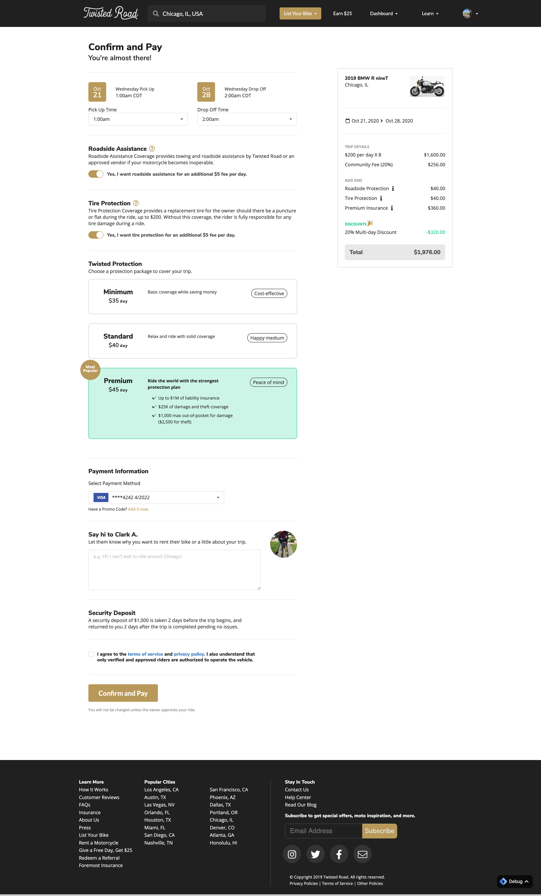
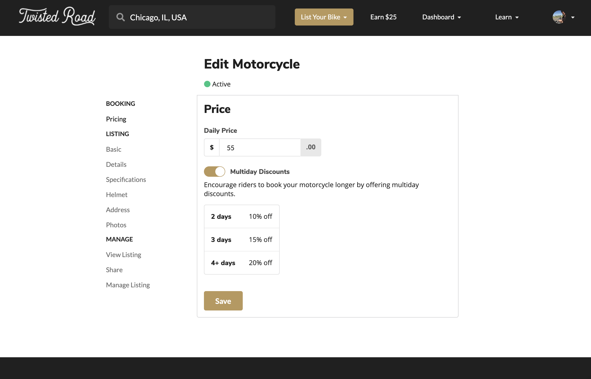

These are React Code Examples! You can find some explanations below. 
All of the UX and Design work is also by me. 
You can find screenshots of what this code looks like in production in the section below. 

You can find more about me at [https://www.james-winston.com](https://www.james-winston.com) and [LinkedIn](www.linkedin.com/in/james-winston-1b2ab324) 
[View My Resume](images/winston-resume.pdf) 

## Overview
The files include some in production quirks to show that I can work in a production env. 
Namely, "work arounds" and documentation for odd backend code where a backend ticket would take to long to complete and delay frontend deployment, etc. 

## PAYMENT SCREEN
This component is fairly straight forward. Demonstrates a common React pattern of lifting up state as well as making modular components for reuse. You'll also find it uses HOCs for api calls. 

## EDIT MOTORCYCLE
This is more engineered and dynamic set of code. The page is generated from reusable components, but the structure is all dictated from an easy to use configuration object. It's as DRY as possible. 

## API PROCESS
This set of code shows I'm thinking large picture. All the API calls on the app flow throw this encapsulation so that we can catch bad access and refresh tokens and do interceptor logic as needed. 

## UX WORK

### React Native Mobile
No code is included from this in the code examples, but I completed all planning, design, supervision, additional coding, mentoring to junior developers, and UX for the following screens.

### SEARCH to PROFILE to PAYMENT PAGE Flow
UX Designs for main conversion funnel. 

