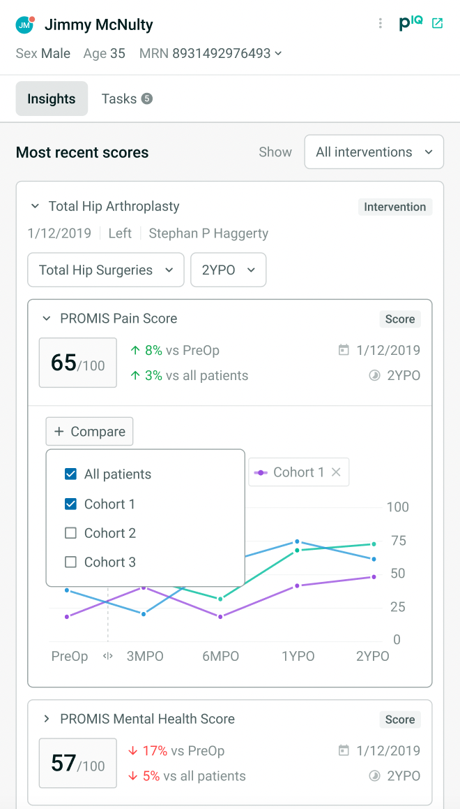

You'll find two directories here. 

## designSystem
Here you'll find some examples of the work that has gone into setting up a component library for BONES, patientIQ's design system.
It's still very much a work in progress, but features React, Typescript and some design system best practices like Styled Compnents, locality files strucutre (atomic design), and adherence to the Style Specification through themeing and the Styled System utility package.

## applicationCode
This is a directory that includes the bones of a payment page that I set up for my previous job at Twisted Road, a consumer facing peer to peer motorcycle sharing app. It's still in React Classes.

## UX Design images
Below you'll find selections from my time as a Frontend Developer and UX Designer at Twisted Road and some of the screens I've implmented as a design system collborative with our product team at patientIQ

You can find more about me at [https://www.james-winston.com](https://www.james-winston.com) and [LinkedIn](www.linkedin.com/in/james-winston-1b2ab324) 
[View My Resume](images/winston-resume.pdf) 

## UX WORK

### React Native Mobile App
No code is included from this in the code examples, but I completed all planning, UX design, supervision, additional coding, and mentoring to junior developers.

### SEARCH to PROFILE to PAYMENT PAGE Flow
UX Designs for main conversion funnel. 

### PatientIQ Panels

